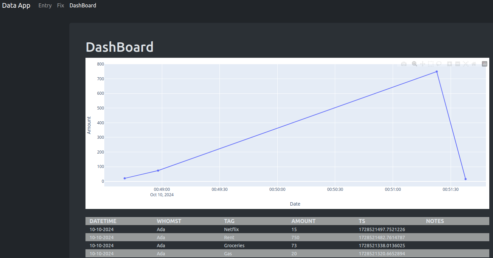
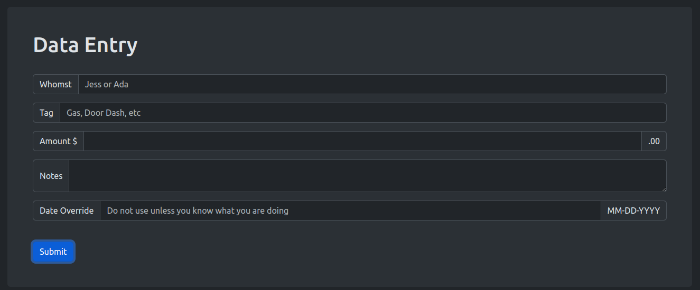

# Simple Finance App



This is a simple app that allows for easy tracking of finances that is networked and reachable by anything on a home network.

Use the following command to spin up a Docker container with the application:

```shell
sudo docker run -d -p 5000:5000  --restart unless-stopped lovelylazuli/simple-finance-app
```

## Use

Transactions are entered using the Entry form that is at endpoint `/`



Once entered, the browser will be redirected to the endpoint `/dashboard`

Entries can be removed using the `/fix` endpoint and providing the __ts__ value in the form.

Finally, there is a `/dump` endpoint that creates a CSV of all transactions for use in tools like pandas or excel.


